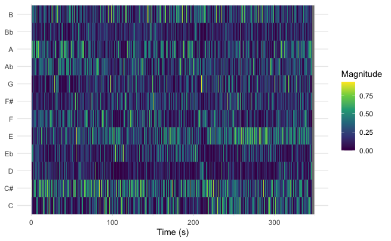
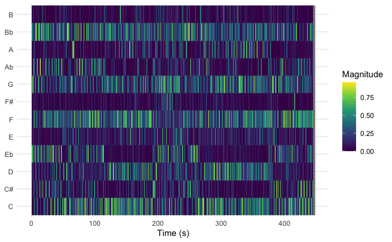
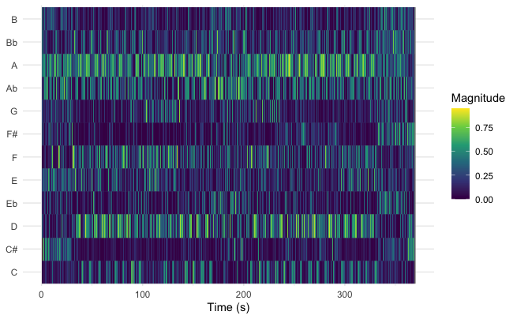
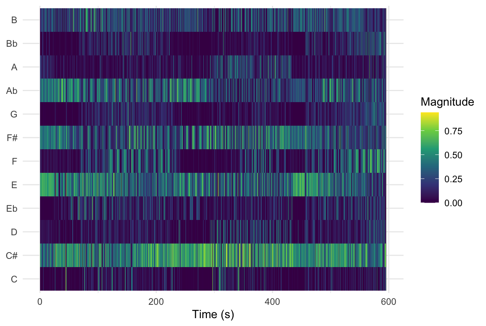
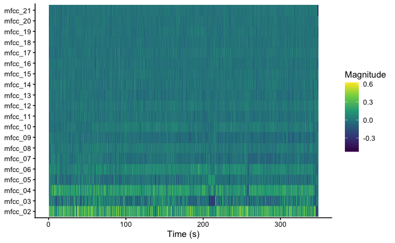
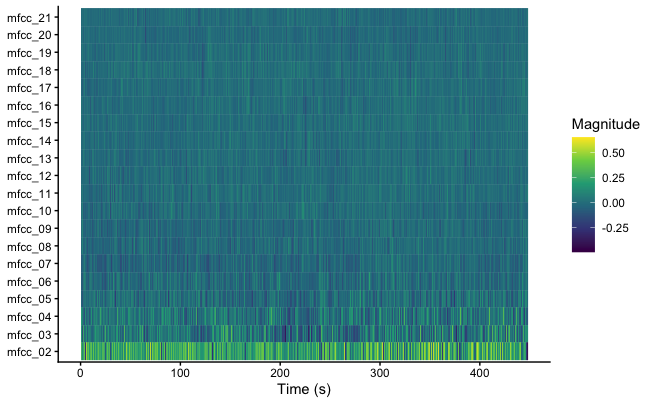
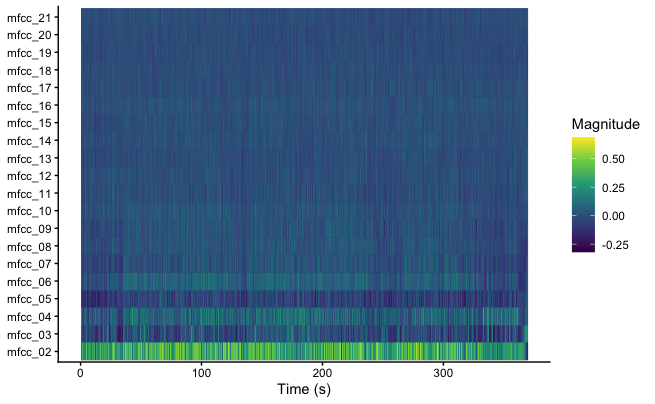
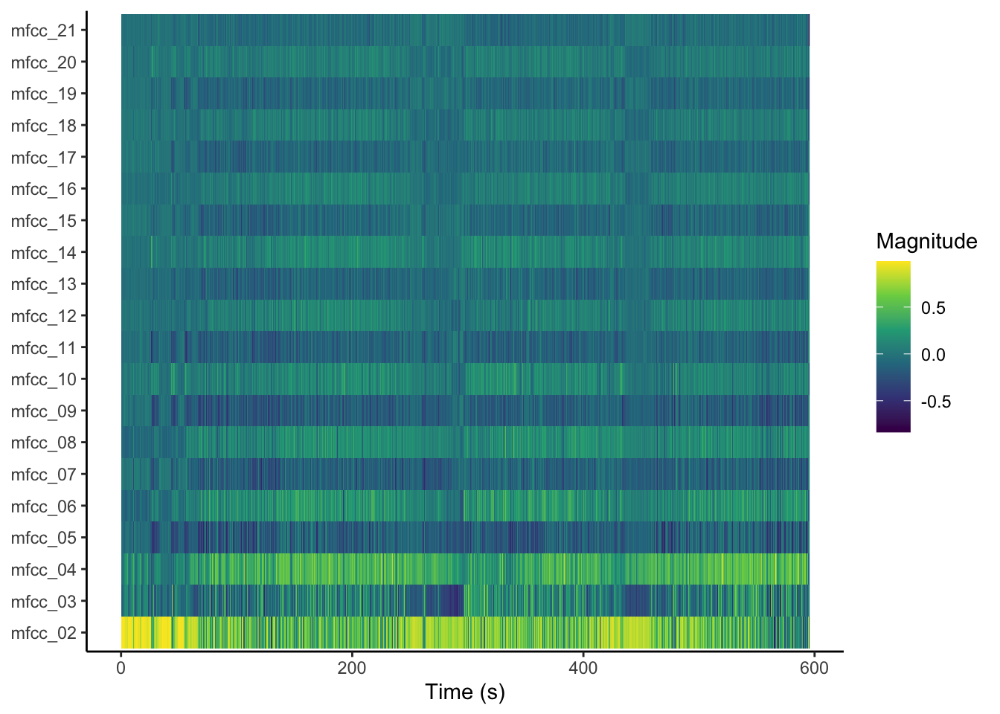

```{r, echo=FALSE}
knitr::opts_chunk$set(warning = FALSE, message = FALSE, echo = FALSE)
```

::::::: panel-tabset
# Welcome

:::::: columns
::: {.column width="55%"}
## Intro

This repository was created for the course **Computational Musicology** at the University of Amsterdam.\
It contains an analysis of a selected corpus of music from my playlist *"I Don't Want This Groove to Ever End"*.

### The Playlist

The playlist *"I Don't Want This Groove to Ever End"*, named after its first track, is a collection of what I find groovy songs: **tracks that are heavily based on a looped or recurring musical phrase or rhythmic pattern**. Only songs of around 6 minutes or longer get added to this playlist, to allow the listener to immerse themselves in each one.

The tracks are mostly unique and vary greatly, and hearing a contrasting groove immediately after another can disrupt the listening experience. To prevent this, I have put a lot of thought into arranging their order.

### The Analysis

The goal of the conducted analysis will be to show how well some musical features can be used to determine the order of the playlist, based on the similarity of the tracks. The following musical featuers will be used: - like Spotify track-level features, - chroma, timbre, and temporal features, - and volume or loudness
:::

::: {.column width="5%"}
:::

::: {.column width="40%"}
<p style="margin-top: 0;">

You can view and listen to the playlist here:

</p>

<iframe data-testid="embed-iframe" style="border-radius:12px" src="https://open.spotify.com/embed/playlist/5R4pN6j7ogQeuaAVptvOnW?utm_source=generator&amp;theme=0" width="100%" height="400" frameBorder="0" allowfullscreen allow="autoplay; clipboard-write; encrypted-media; fullscreen; picture-in-picture" loading="lazy">

</iframe>
:::
::::::

# Background

```{r, include=FALSE}
knitr::opts_chunk$set(echo = FALSE)
library(tidyverse)
library(dplyr)
library(readr)
library(ggplot2)
```

```{r load playlist, include=FALSE}
playlist <- read_csv("~/Desktop/UvA/computational_musicology/groove_analysis/IDWTGTEE/I_Don't_Want_This_Groove_to_Ever_End.csv")

playlist <- playlist[1:(nrow(playlist) - 4), ]

playlist |>
  summarise(
    mean_speechiness = mean(Speechiness),
    mean_acousticness = mean(Acousticness),
    mean_liveness = mean(Liveness),
    sd_speechiness = sd(Speechiness),
    sd_acousticness = sd(Acousticness),
    sd_liveness = sd(Liveness),
    median_speechiness = median(Speechiness),
    median_acousticness = median(Acousticness),
    median_liveness = median(Liveness),
    mad_speechiness = mad(Speechiness),
    mad_acousticness = mad(Acousticness),
    mad_liveness = mad(Liveness)
  )
```

```{r number tracks, echo=FALSE}
playlist$track_number <- 1:nrow(playlist)
```

### Mix of features

After having loaded the playlist, I deleted the last four tracks from the data frame that will be analyzed, since they are not yet assigned a place in the playlist. I have then computed the transition distance across all features. This will allow me to check for spikes along the playlist length to see which moments or tracks have the least smooth transitions so that I can focus on those.\

```{r}
# compute transition distance
playlist <- playlist %>%
  mutate(
    d_energy = Energy - lag(Energy),
    d_tempo = Tempo - lag(Tempo),
    d_dance = Danceability - lag(Danceability)
  )

playlist <- playlist %>%
  mutate(
    transition_distance = sqrt(
      d_energy^2 + d_tempo^2 + d_dance^2
    )
  )

ggplot(playlist, aes(x = track_number, y = transition_distance)) +
  geom_line() +
  geom_point() +
  theme_minimal()
```

\
Note that the distances of subsequent points on the graph does not correspong to a bigger spike, but for each track the transition distance from the previous one is shown. This means that everywhere there is a spike, there is a large transition distance. <br> Also as the first song has none before it, it is omitted from the graph, we start with the second track.\
This graph shows that when we take a couple of the track-level features, namely: energy, tempo and danceability.\
The following songs have most different transitions:

```{r, echo=FALSE}
library(knitr)

top5_transitions <- playlist %>%
  mutate(previous_track = lag(`Track Name`)) %>%
  slice_max(order_by = transition_distance, n = 5) %>%
  select(previous_track, `Track Name`, track_number, transition_distance)

kable(top5_transitions, format = "html", digits = 2, caption = "Top 5 Playlist Transitions")
```
To make sure that my ordering of the track influenced the Spotify track level features of the playlist at all, I will compare the mean multivariate distance of both my playlist and the same songs from it ordered in a random way.

```{r, include=TRUE, echo=TRUE}
set.seed(1)

random_distances <- replicate(100, {
  shuffled <- playlist %>% sample_frac(1)
  
  d_energy <- diff(shuffled$Energy)
  d_valence <- diff(shuffled$Valence)
  d_tempo  <- diff(shuffled$Tempo)
  d_dance  <- diff(shuffled$Danceability)
  
  mean(sqrt(d_energy^2 + d_valence^2 + d_tempo^2 + d_dance^2))
})

mean_original <- mean(playlist$transition_distance, na.rm = TRUE)
# the mean multivariate distance of tracks in my playlist:
mean_original
# the eman multivariate distance of the same tracks in random order:
mean(random_distances)
```

This shows that my ordering did indeed influence the Spotify track level features positively, as expected. The mean multivariate distance between tracks is lower in my playlist than in a randomly ordered one. We can conduct the analysis, assuming that Spotify track-level features meaningfully approximate perceptual groove similarity. 
### Tempo

```{r tempo graph}
ggplot(playlist, aes(x = track_number, y = Tempo)) +
  geom_line() +
  geom_point() +
  labs(
    title = "Tempo Across Playlist Order",
    x = "Playlist Position",
    y = "Tempo"
  ) +
  theme_minimal()
```

<br> This graph shows a few sudden spikes across the length of the playlist, although some of them can be eliminated. The first spike for example, which happens because track 7 has a tempo of 200, more than twice the tempo of the previous song. However, the song is very relaxed and I believe it can be perceived as half the speed. The same case can be seen on track 72 - Lose Yourself to Dance. That is why I will divide the tempos of these songs by two.

```{r}
#| results: hide
library(dplyr)

playlist <- playlist %>%
  mutate(Tempo = if_else(
    track_number %in% c(7, 62),
    Tempo / 2,
    Tempo
  ))


playlist %>%
  filter(track_number %in% c(7, 62)) %>%
  select(track_number, Tempo)
```

### Singular Features

Now that the bpm has been scaled, here are the graphs for tempo across tracks in the playlists, as well as danceability and energy.

```{r}
#| column: screen-inset-shaded
#| layout-nrow: 1
# tempo
ggplot(playlist, aes(x = track_number, y = Tempo)) +
  geom_line() +
  geom_point() +
  labs(
    title = "Tempo Across Playlist Order",
    x = "Playlist Position",
    y = "Tempo"
  ) +
  theme_minimal()

# danceability
ggplot(playlist, aes(x = track_number, y = Danceability)) +
  geom_line() +
  geom_point() +
  labs(
    title = "danceability Across Playlist Order",
    x = "Playlist Position",
    y = "Danceability"
  ) +
  theme_minimal()

# energy
ggplot(playlist, aes(x = track_number, y = Energy)) +
  geom_line() +
  geom_point() +
  labs(
    title = "Energy Across Playlist Order",
    x = "Playlist Position",
    y = "Energy"
  ) +
  theme_minimal()
```

<br> These graphs show that seemingly the track-level features that best describe the genre across this playlist are tempo and danceability. Both parameters are most stable in the middle of the playlist between tracks 20-40 more or less. Danceability shows a slight rise and then fall, which would make sense according to how the playlist is structured, but it still has high differences between some neighbouring tracks.

```{r}
top5_tempo_transitions <- playlist %>%
  mutate(
    previous_track = lag(`Track Name`),
    tempo_diff = abs(Tempo - lag(Tempo))
  ) %>%
  slice_max(order_by = tempo_diff, n = 5) %>%
  select(previous_track, `Track Name`, track_number, tempo_diff)

kable(top5_tempo_transitions, format = "html", digits = 2, caption = "Top 5 Tempo Transitions")
```

```{r}
top5_danceability_transitions <- playlist %>%
  mutate(
    previous_track = lag(`Track Name`),
    danceability_diff = abs(Danceability- lag(Danceability))
  ) %>%
  slice_max(order_by = danceability_diff, n = 5) %>%
  select(previous_track, `Track Name`, track_number, danceability_diff)

kable(top5_danceability_transitions, format = "html", digits = 2, caption = "Top 5 Danceability Transitions")
```

### Chosen Tracks

Based on this info, I decided to compare the following neighbouring songs:\
- *Find Your State of Mind* and *I'll Be With You* (tracks 6 and 7), because the songs differ very much in the allround transition score, but not so much in the individual classifications, so I wonder how they differ from eachoter\
- *Goldrush* and *Words 2b Heard Meets Planetary Funk Alert* (tracks 69 and 70), because they differ a lot on many aspects and I wonder if there are some features that show that I have placed them next to each other correctly.


# Chroma Features \[pitch\]
## Chromagrams

Here are the chroma features of the first two tracks,

*Find Your State of Mind* by *Jestofunk*:\
\
\
*I'll be With You* by *Bernie Worrell*:\
\

They show that the songs are played in different keys, which may contribute to their incompatibility. Although, they do share a sudden spike in the e flat pitch around three fourths of the way through the songs, interestingly. 
\
And the second two, 

*Goldrush* by *the Herbaliser*:\
\
\
*Words 2B Heard Meets Planetary Funk Alert* by *MC Conrad*:\
{width="85%"}\

Here there again isn't overlap, however in *Goldrush* we can see that the most prominent pitches are A and D, while in *Words 2B Heard...* A flat and C sharp. This suggests that the pitch content of the second song is transposed down by a semitone relative to the first, but both might use a similar melodic structure.

# Loudness 
## Loudness, volume
```{r}
ggplot(playlist, aes(x = track_number, y = Loudness)) +
  geom_line() +
  geom_point() +
  labs(
    title = "Loudness Across Playlist Order",
    x = "Playlist Position",
    y = "Loudness"
  ) +
  theme_minimal()
```
Looking at the loudness between tracks, I clearly did not take that into consideration when ordering the playlist. I know that Spotify has a feature 'volume normalization' which I have turned on in settings, so maybe I cannot even hear the differences. Interestingly though, again in the middle seems to be the smallest variance, where the house tracks are.


# Timbre Features
## Cepstrorgams
Here are the cepstrograms for the analysed songs:

*Find Your State of Mind* by *Jestofunk*:\
\
\
*I'll be With You* by *Bernie Worrell*:\
\

Again, there deos not seem to be much overlap, however there is a similar lacl of activity in the third coefficient around the same time in the songs. Again maybe there is a slight similarity in something there is played there. 
\
And the second two, 

*Goldrush* by *the Herbaliser*:\
\
\
*Words 2B Heard Meets Planetary Funk Alert* by *MC Conrad*:\
{width="85%"}\

These images tell totally oppsoing stories. The second cepstrogram shows a very structured pattern, while in the first one there seems to be hardly any structure. The only similarity seems to be that the fifth feature is prominent, while the sixth one very much is not. 

# Clustering
## k-means clustering
The tracks on this playlist are supposed to take the listener through different genres, while not changing it too much between tracks. If I had to, I would divide the main genres into three categories:\
**1. Funk,** \
**2. House/electro,** and \
**3. Hip-Hop/R&B.** \
I think all songs on this playlist are part of one of these three genres. This is why I want to use a k-means algorithm to see how it groups the songs and if we agree on order. \
\
first I created an elbow graph to see the optimal number of clusters based on the track-level features of the playlist. Although the elbow is not too prominent, the best number seems to be three, which alligns with the number of genres I believe there are. 

```{r kmeans scaling}
features <- playlist %>%
  select(Energy, Valence, Danceability, Tempo, Acousticness)

features_scaled <- scale(features)
```

```{r}
# check optimal number of clusters
set.seed(123)

wss <- sapply(seq(1, 11, by = 2), function(k) {
  kmeans(features_scaled, centers = k, nstart = 25)$tot.withinss
})

elbow_df <- data.frame(
  k = seq(1, 11, by = 2),
  wss = wss
)

ggplot(elbow_df, aes(x = k, y = wss)) +
  geom_line() +
  geom_point() +
  labs(
    title = "Elbow Method for Optimal k",
    x = "Number of Clusters (k)",
    y = "Within-Cluster Sum of Squares"
  ) +
  theme_minimal()
```


```{r kmeans3}
# 3 clusters
set.seed(12)

kmeans_result <- kmeans(features_scaled, centers = 3, nstart = 25)

playlist$cluster <- kmeans_result$cluster

ggplot(playlist, aes(x = track_number, y = cluster)) +
  geom_point() +
  geom_line() +
  theme_minimal()
```
I applied the algorithm and plotted the results on a graph, where every song is displayed in a continuous manner, to preserve the order of the playlist when  viewing the graph. \
Sudddenly, the best placement is not between tracks number 20 and 40 anymore. it is clearly near the end, where a staggering 12 subsequent songs are grouped together. In the area that was so successfull before, we have jumps between two groups only. That is still better than jumping between three groups. I have no idea what might have caused these differences in the most homgenous group yet, and will definitely explore it further when I have more time.
\
There is also a very good streak right at the start between from track 4 to track 16, where the run is interrupted only twice. \
This means that the k-means algorithm ran on the track-level features from Spotify, agrees most with me on the Funk in my playlist, as well as the Hip-Hop/R&B, while the electronic music is placed very differently. This makes sense I suppose since electronic music isn't really a genre and the songs can vary a lot. \
The algorithm performed prety well considering, but this indicates that feature-based clustering does not fully align with human-perceived groove continuity"


# Conclusion

This study demonstrates that computational features can assist in understanding and organizing groove-based playlists, but only to a certain extent. \
The reduced transition distances compared to a random baseline suggest that Spotify features are capable of capturing aspects of musical similarity relevant to ordering. However, the results from k-means clustering and feature-specific analyses reveal mismatches between computational grouping and perceived flow. These discrepancies point to important dimensions, such as harmonic context and timbre structure, that are not fully represented in track-level features. \
For playlist curators, this means that while such features can be used to identify problematic transitions or general trends, effective sequencing still depends on human listening and interpretation.\
\
Thankfully, the conlusion is that human feeling is yet to be replaced by robots if it comes to recognising and building a solid groove :)
:::::::

